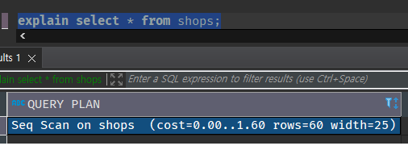
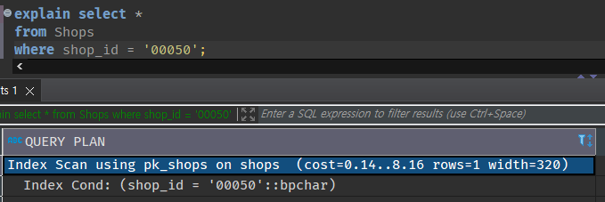
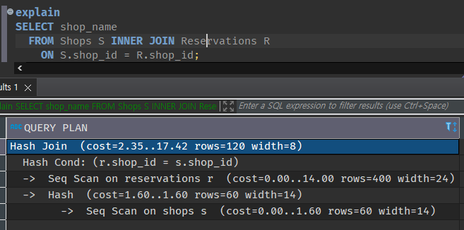

# chap 01 DBMS 아키텍처

 

## 4강 실행 계획이 SQL 구문의 성능을 결정

실행계획이 만들어지면 DBMS는 그것을 바탕으로 데이터 접근을 수행한다. 하지만 데이터양이 많은 테이블에 접근하거나 복잡한 SQL 구문을 실행하면 반응 지연이 발생하는 경우가 꽤 있다.
그 이유로는 앞에서 설명했던 것처럼 통계 정보가 부족한 경우도 있으나, 이미 최적의 경로(방법)가 설정되어 있는데도 느린 경우도 있다. 또한 통계 정보가 최신이라도 SQL구문이 너무 복잡하면 옵티마이저가 최적의 접근 경로(방법)를 선택하지 못할 수도 있다.

### 1. 실행 계획 확인 방법

- 이러한 SQL 구문의 지연이 발생했을 때 제일 먼저 실행 계획을 살펴봐야 한다. 모든 DBMS는 실행 계획을 조사하는 수단을 제공한다.

다음과 같은 3개의 기본적인 SQL 구문의 실행 계획을 살펴보겠다.

    1. 테이블 풀 스캔(Full Scan)의 실행 계획
    2. 인덱스 스캔의 실행 계획
    3. 간단한 테이블 결합의 실행 계획

### 2. 테이블 풀 스캔의 실행 계획

포함된 내용 3가지

    1. 조작 대상 객체
    2. 객체에 대한 조작의 종류
    3. 조작 대상이 되는 레코드 수

- 조작 대상 객체

조작 대상 객체는 on 이라는 글자 뒤에 shops 테이블이 출력된다.

- 객체에 대한 조작의 종류

객체에 대한 조작의 종류는 실행 계획에서 가장 중요한 부분이다. 'Seq Scan'은 '순차적인 접근(Sequential Scan)'의 줄임말로 '파일을 순차적(Sequential)으로 접근해서 해당 테이블의 데이터 전체를 읽어낸다'는 의미이다.
Oracle 'TABLE ACCESS FULL'은 '테이블의 데이터를 전부 읽어들인다'는 의미이다.

- 조작 대상이 되는 레코드 수

세 번째로 중요한 항목은 조작 대상이 되는 레코드 수이다. 이는 두 가지 DBMS 모두 Rows라는 항목에 출력된다. 결합 또는 집약이 포함되면 1개의 SQL 구문을 실행해도 여러 개의 조작이 수행된다. 그러면 각 조작에서 얼마만큼의 레코드가 처리되는지가 SQL 구문 전체의 실행 비용을 파악하는 데 중요한 지표가 된다.

이 숫자는 카탈로그 매니저로부터 얻은 값이므로 실제 SQL을 실행한 시점의 테이블 레코드 수와 차이가 있을 수 있다.

### 3. 인덱스 스캔의 실행 계획

위 실행계획과 다른 점 3가지

- 조작 대상이 되는 레코드 수

Rows가 1로 바뀌었다. where구에서 기본 키가 '00050'인 점포를 지정했으므로 접근 대상은 반드시 레코드 하나이기 때문이다.

- 접근 대상 객체와 조작

'Index Scan'은 인덱스를 사용해 스캔을 수행한다는 것이다.

인덱스 스캔은 일반적으로는 스캔하는 모집합 레코드 수에서 선택되는 수가 적다면 테이블 풀 스캔보다 빠르게 접근을 수행한다. 이는 풀 스캔이 모집합의 데이터양에 비례해서 처리 비용이 늘어나는 것에 반해, 인덱스를 사용할 때 활용되는 B-tree 가 모집합의 데이터양에 따라 대수 함수적으로 처리 비용이 늘어나기 때문입니다.

간단하게 말해서 인덱스의 처리 비용이 완만한게 증가한다는 뜻으로, 특정 데이터양(N)을 손익분기점으로 인덱스 스캔이 풀 스캔보다도 효율적인 접근을 하게 된다는 것이다.

### 4. 간단한 테이블 결합의 실행 계획

결합을 수행하는 쿼리의 실행 계획을 살펴보자. SQL에서 지연이 일어나는 경우는 대부분 결합과 관련된 것이다.
결합을 사용하면 실행 계획이 상당히 복잡해지므로, 옵티마이저도 최적의 실행 계획을 세우기 어렵다. 따라서 결합 시점의 실행 계획 특성을 공부하는 것은 굉장히 중요한 의미가 있다.

합의 실행 계획을 이해하는 것이 이 책의 목적 중 하나이다.

일반적으로 DBMS 결합을 할 때는 세 가지 종류의 알고리즘을 사용한다.

1. 가장 간단한 결합 알고리즘은 Nested Loops이다. 한쪽 테이블을 읽으면서 레코드 하나마다 결합 조건에 맞는 레코드를 다른 쪽 테이블에서 찾는 방식이다.
2. Sort Merge이다. 결합 키(현재 예제에서는 점포 ID)로 레코드를 정렬하고, 순차적으로 두 개의 테이블을 결합하는 방법이다. 결합 전에 전처리로 (원칙적으로) 정렬을 수행해야 하는데요. 이때 작업용 메모리로 워킹메모리를 사용한다.
3. Hash이다. 이름 그대로 결합 키 값을 해시값으로 맵핑하는 방법이다. 해시 테이블을 만들어야 하므로, 마찬가지로 작업용 메모리 영역을 필요로 한다.

- 객체에 대한 조작의 종류

* 실행 계획은 일반적으로 트리 구조이다. 결합의 경우 어떤 테이블에 먼저 접근하는지가 굉장히 중요한 의미를 갖는다. 같은 중첩 단계에서는 위에서 아래로 실행한다는 뜻이다. Reservation 테이블과 Shop 테이블 접근이 같은 중첩 단계에 있지만, Reservation 테이블에 대한 접근이 위에 있으므로 Reservation 테이블에 대한 접근이 먼저 일어난다는 것을 알 수 있다.
