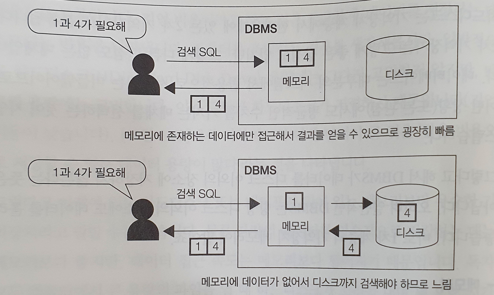
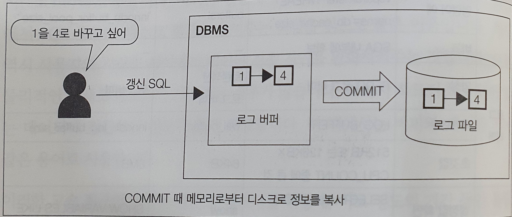
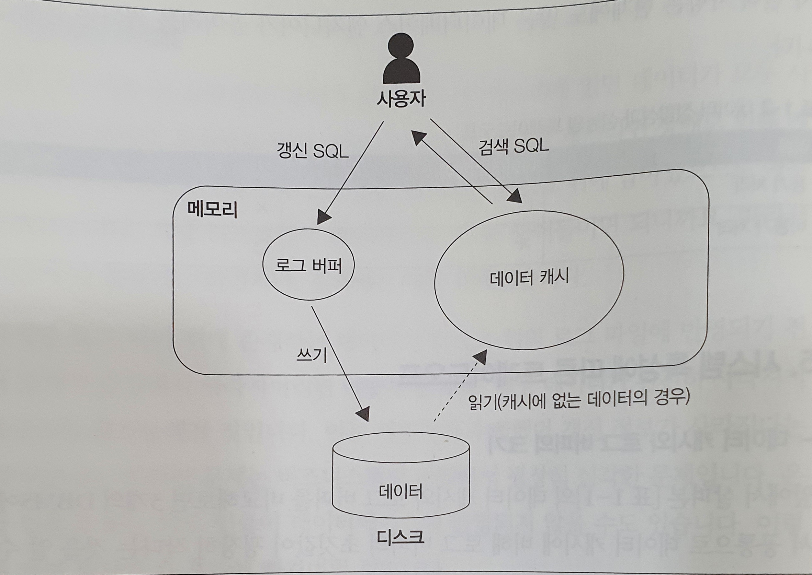

# DBMS와 버퍼

### 1. 공짜 밥은 존재할까?

#### 기억장치의 분류를 계층으로 나타낸 사진

* 보통 기억장치는 기억비용(기억코스트)에 따라 1차부터 3차까지의 계층으로 분류된다
  * 기억비용 : 데이터를 저장하는데 소모되는 비용
* 위 사진에서 피라미트 아래 면적이 큰 부분은 같은 비용으로 저장할 수 있는 데이터 용량이 많다는 것을 나타낸다
  * 하지만 아래 있는 하드나 테이프가 메모리보다 우수한 기억장치라는 것은 아니다
    * 많은 데이터를 영속적으로 저장하기는 좋지만 데이터 접근 속도는 메모리보다 떨어지기 때문이다
* 많은 데이터를 영속적으로 저장하려면 속도를 잃고 속도를 얻고자 하면 많은 데이터를 영속적으로 저장하기 힘든 트레이드오프가 발생한다
  * 한마디로 시스템에 공짜 밥은 없으며 이것이 저장소와 관련되어 나타나는 첫번째 트레이드오프다

### 2. DBMS와 기억장치의 관계
* DBMS는 데이터 저장을 목적으로 하는 미들웨어이며 기억장치와 떨어뜨릴 수 없는 관계다
* DBMS가 사용하는 대표적인 기억장치는 아래 2개다
1. 하드디스크
   * DBMS가 데이터를 저장하는 매체는 현재 대부분 HDD이며 용량,비용,성능의 관점에서 선택되었다
     * HDD가 아닌 다른 선택사항도 있다
       * 인메모리 데이터베이스는 이름 그대로 메모리에 데이터를 저장하며 테이프 등의 매체에 백업한다
       * SSD라는 플래시 메모리를 사용한 빠르고 영속적인 기억장치도 상용화 되고 있지만 가격이 비싸서 널리 퍼지진 않았다
   * 하드디스크는 기억장치 계층에서 한가운데에 있는 2차 기억장치로 분류된다
     * 큰 장점도 없지만 큰 단점도 없는 매체다
   * DBMS가 데이터를 디스크 이외의 장소에 저장하지 않는것은 아니다
     * 오히려 일반적인 DBMS는 항상 디크스 이외의 장소인 1차 계층 기억장치 메모리에 데이터를 올려 놓는다

2. 메모리
   * 메모리는 디스크에 비해 기억 비용이 굉장히 비싸다
     * 하드웨어 1대에 탑재할 수 있는 양이 크지 않다
   * 일반적인 데이터베이스 서버의 경우 탑재되는 메모리 양은 한두 자리 정도이며 100GB를 넘는 경우는 많지 않다
     * 테라바이트 단위의 용량을 가지는 하드와 비교하면 엄청나게 작은 크기다
   * 규모 있는 상용 시스템의 데이터베이스 내부 데이터를 모두 메모리에 올리는건 힘들다

3. 버퍼를 활용한 속도 향상
   * 그럼에도 불구하고 DBMS가 일부라도 데이터를 메모리에 올리는 이유는 성능 때문이다
     * SQL 구문의 실행 속도를 빠르게 만들기 위한것
   * 메모리는 가장 빠른 1차 기억장치라 자주 접근하는 데이터를 메모리 위에 올려둔다면 같은 SQL 구문을 실행해도 디스크에서 데이터를 가져올 필요 없이 곧바로 메모리에서 읽어 데이터를 빠르게 검색 가능하다

#### 메모리에 데이터가 있으면 고속으로 처리가 가능하다

* 디스크 접근을 줄이면 굉장히 큰 폭의 성능 향상이 가능하다
  * 보통 SQL 구문의 실행시간 대부분이 저장소 I/O에 사용되기 때문
    * 전부 그런건 아니며 매우 적은 양의 데이터만 접근하는 SQL 구문은 상대적으로 저장소의 I/O보다 CPU 연산에 많은 시간을 잡아먹는다
#### 이렇게 성능 향상을 목적으로 데이터를 저장하는 메모리를 버퍼(buffer) 또는 캐시(cache)라고 부른다
* 버퍼는 완충제라는 의미로 사용자와 저장소 사이에서 SQL 구문의 디스크 접근을 줄여주는 역할을 하기 때문에 붙은 이름이다
* 캐시도 사용자와 저장소 사이에서 데이터 전송 지연을 완화시켜준다
  * 모두 물리적인 매체로 메모리가 사용되는 경우가 많아서 하드위에 있는 데이터에 접근하는것 보다 훨씬 빠르다
* 버퍼에 데이터를 어떻게 어느정도 기간동안 올릴지 관리하는게 DBMS의 버퍼 매니저이며 성능에 굉장히 중요한 영향을 끼친다

### 3.메모리 위에 있는 두 개의 버퍼
DBMS가 데이터를 유지하기 위해 사용하는 메모는 아래와 같은 두 종류이다
* 데이터 캐시
* 로그 버퍼

대부분의 DBMS는 이런 두 개의 역할을 하는 메모리 영역을 가지고 있으며 이런 버퍼는 사용자가 용도에 따라 크기를 변경하는게 가능하다

아래 사진은 이런 메모리의 크기를 DBMS의 종류에 따라 보여준다
#### DBMS의 버퍼 메모리의 제어 매개변수

1. 데이터 캐시
   * 데이터 캐시는 디스크에 있는 데이터의 일부를 메모리에 유지하기 위해 사용하는 메모리 영역이다
     * 만약 select 구문에서 선택하고 싶은 데이터가 전부 데이터 캐시에 있으면 디스크에 접근하지 않고 처리가 수행되어 굉장히 빠르게 응답한다
     * 반대로 버퍼에서 데이터를 찾을 수 없다면 저속 저장소 까지 데이터를 가지러 가기 때문에 응답 속도가 느려진다
     * 데이터베이스 세계에서는 '디스크를 건드리는 자는 불행해진다' 라는 격언이 있다

2. 로그 버퍼
   * 로그 버퍼는 갱신 처리(INSERT, DELETE, UPDATE, MERGE)와 관련 있다
   * DBMS는 갱신과 관련된 SQL 구문을 사용자로부터 받으면 바로 저장소에 있는 데이터를 변경하지 않는다
     * 일단 로그 버퍼 위에 변경 정보를 보내고 이후 디스크에 변경을 수행한다
       * 로그 파일에 출력되는 시점에서는 커밋이 일반적이지만 그 이외 시점에 출력되는 경우도 있다
     * 데이터 베이스의 갱신 처리는 SQL 구문의 실행 시점과 저장소에 갱신하는 시점에 차이가 있는 비동기 처리다

#### 갱신 처리는 비동기로 이루어진다     

* SQL 구문을 실행할때 단순히 저장소의 파일을 변경하는게 더 쉽지만 DBMS는 성능 향상을 위해 이러한 시점 차이를 둔다
* 저장소는 검색만이 아닌 갱신을 하는 경우에도 상당한 시간이 소모되며 저장소 변경이 끝날 때까지 기다리면 사용자는 장시간 대기하게 된다
  * 따라서 한 번 메모리에 갱신 정보를 받은 시점에 사용자에게 해당 SQL 구문이 끝났다고 알려주고 내부적으로는 처리를 하고 있는것이다

### 4. 메모리의 성질이 초래하는 트레이드 오프
* 메모리가 가진 단점은 '가격이 비싸서 보유할 수 있는 데이터양이 적은 것' 이 끝이 아니다

#### 휘발성
* 메모리에는 데이터 영속성이 없다
  * 하드웨어의 전원을 꺼버리면 메모리 위에 올라간 데이터는 모두 사라진다
    * 내부에 전원 공급이 없어도 데이터를 잃지 않는 메모리도 있지만 일반적인 서버에는 사용하지 않는다
* DBMS를 껐다 켜면 버퍼 위의 모든 데이터가 사라진다
  * DBMS에 어떤 장애가 발생해 프로세스다운이 일어나면 메모리 위에 있는 모든 데이터가 날아가는것
* 메모리는 영속성이 없는 이상 기능적으로 디스크의 완전 대체가 불가능하다

#### 휘발성의 문제점
* 휘발성의 가장 큰 문제점은 장애가 발생했을 때 메모리에 있던 데이터가 모두 사라져 데이터의 부정합을 발생시키는 것
  * 데이터 캐시라면 장애로 인해 메모리 위의 데이터가 사라져도 원본 데이터는 디스크 위에 남아 있기 때문에 아무 문제가 없다
  * 하지만 로그 버퍼 위에 존재하는 데이터가 디스크 위의 로그 파일에 반영되기 전에 장애가 발생해서 사라지면 문제가 생긴다
    * 해당 데이터가 완전히 사라져 복구가 불가능해진다
      * 사용자가 수행했던 갱신 정보가 사라진다는 의미다
    * 로그 파일에 전달된 갱신 정보가 DBMS가 다운될 때 사라지는 현상은 DBMS가 갱신을 비동기로 하는 이상 언제든 발생 가능한 문제다
      * 이를 회피하기 위해 DBMS는 커밋 시점에 반드시 갱신 정보를 로그 파일(영속적인 저장소 위에 존재)에 씀으로서 장애가 발생해도 정합성을 유지할 수 있게 한다
      * 커밋이란 갱신 처리를 확정하는 것이다(DBMS는 커밋된 데이터를 영속화한다)
      * 반대로 말하면 커밋 때는 반드시 디스크 동기 접근이 일어나며 여기서 느려질 가능성이 있다
#### 디스크에 동기 처리를 하면 데이터 정확성은 높아지지만 성능은 낮아지고 성능을 높이려면 데이터 정확성이 낮아진다
* 이것이 두번째 트레이드 오프다

|이름|데이터 정합성|성능|
|-------|---|---|
|동기 처리|O|X|
|비동기 처리|X|O|

### 5. 시스템 특성에 따른 트레이드오프
#### 데이터 캐시와 로그 버퍼의 크기
* 보통 데이터 캐시에 비해 로그 버퍼의 초기값은 굉장히 작은데 데이터 베이스가 2개의 버퍼에 대해 이렇게 극단적으로 비대칭적인 크기를 할당한 명확한 이유가 있다
  * 데이터베이스가 기본적으로 검색을 메인으로 처리한다고 가정하기 때문이다
    * 검색 처리를 할 때는 검색 대상 레코드가 엄청나게 많은 경우도 자주 발생한다
    * 갱신 처리를 할 때는 갱신 대상이 많아 봤자 트랜잭션마다 한 건에서 수만 건 정도뿐이다(트랜잭션 규모에 따라 다를 수 있음)
    * 따라서 갱신 처리에 값비싼 메모리를 많이 사용하기 보다는 자주 검색하는 데이터를 캐시에 올려놓는게 좋다고 생각한것

실제로 많은 DBMS가 물리 메모리에 여유가 있다면 데이터 캐시를 되도록 많이 할당하는걸 추천한다
* 하지만 사용하는 시스템이 갱신이 더 많다면 초기 설정 그대로 사용해서는 성능이 잘 나오지 않을 것이다
  * 이런 경우에는 로그 버퍼의 크기를 늘려주는 튜능을 고려해보자

#### 검색과 갱신 중에서 중요한 것
* 검색과 갱신 중 어느게 더 우선순위가 되어야 할까(트레이드오프)
* 시스템에 걸리는 부하에 비해 메모리가 많이 남는다면 아무 고민할 필요 없이 데이터 캐시와 로그 버퍼 모두 충분한 메모리를 할당하면 된다
  * 최근의 DBMS는 리소스를 자동으로 조정하는 기능도 있으며 이를 사용해 메모리 할당을 스스로 조정하는 DBMS도 있다
    * 하지만 이것도 한계가 있으며 굉장히 중요한 리소스 배분이 필요한 경우 자동 설정에 의지하는것은 위험하다
    * 이런경우 적절한 판단을 위해 데이터베이스가 어떤 생각에 기반을 둬서 리소스를 배분하고 있는지 이해하는게 중요하다
      * 로그 버퍼가 크게 잡혀 있으면 갱신 처리와 관련해 큰 부하가 걸릴 것을 고려한 설계임을 알 수 있다
      * 데이터 캐시가 크게 잡혀있다면 검색 처리와 관련된 처리가 중심이라는 것을 알 수 있다

### 6. 추가적인 메모리 영역 '워킹 메모리'
#### 언제 사용될까?
* DBMS는 앞에서 설명한 2개의 버퍼 이외에도 일반적으로 메모리 영역을 하나 더 가지고 있다
  * 정렬 또는 해시 관련 처리에 사용되는 작업용 영역으로 워킹 메모리(working memory)라고 부른다
    * 정렬은 ORDER BY 구, 집합 연산, 윈도우 함수 등의 기능을 사용할 때 실행된다
    * 해시는 주로 테이블 등의 결합에서 해시 결합이 사용되는 경우 실행된다
      * 최근에는 GROUP BY 에서도 해시 알고리즘이 사용되는 경우가 있다
  * 이 메모리 영역의 이름과 관리 방법은 DBMS에 따라 다르다
  
| DBMS           | 명칭                       | 매개변수                 | 기본값                        |
|----------------|--------------------------|----------------------|----------------------------|
| Oracle 11g R2  | PGA(Program Global Area) | PGA_AGGREGATE_TARGET | 10MB 또는 SGA 크기의 20% 중에 큰 것 |
| PostgreSQL 9.3 | 워크 버퍼                    | work_mem             | 8MB                        |
| MySQL 5.7      | 정렬 버퍼                    | sort_buffer_size     | 256 KB                     |

* 이 작업용 메모리 영역은 SQL에서 정렬 또는 해시가 필요한 경우 사용되며 종료되면 해제되는 임시 영역이다
* 일반적으로 데이터 캐시와 로그 버퍼와는 다른 영역으로 관리되는 경우가 많다
* 이 영역이 성능적으로 중요한 이유는 만약 이 영역이 다루려는 데이터양보다 작아 부족해지는 경우가 생기면 대부분의 DBMS가 저장소를 사용하기 때문이다
  * OS 동작에서 말하는 스왑(swap)과 같다

메모리가 부족한 경우에는 저장소 사용

많은 DBMS는 워킹 메모리가 부족할 때 사용하는 임시적인 영역을 가지고 있다
* Oracle : 임시 테이블 스페이스(TEMP Tablesapce)
* Microsoft SQL Server : TEMPDB
* PostgreSQL : 일시 영역(pgsql_tmp)
* 이런 영역들은 저장소 위에 있기 때문에 당연히 접근 속도가 느리다

#### 부족하면 무슨 일이 일어날까?
* 저장소가 부족해지면 무슨일이 일어날까??
  * 저장소는 메모리에 비해 굉장히 느리다
  * 굉장히 느린 저장소에 접근하게 되면 당연히 전체적인 속도가 느려진다
  * 물론 메모리가 부족하다고 처리가 멈추거나 에러가 발생하는 것처럼 심각한 문제가 생기는 것은 아니다
    * 메모리에서 작동하고 있을 때는 빠르게 움직이다가 메모리가 부족해지는 순간 갑자기 느려지는 순간적인 변화가 일어나는게 문제다
* 이 영역은 여러개의 SQL 구문들이 공유해 사용해 하나의 SQL 구문을 실행하고 있을 때는 메모리에 잘 들어가지만 여러 개의 SQL 구문을 동시에 실행하면 메모리가 넘치는 경우가 있다
  * 이런 상황을 재현하는 검사(부하검사)를 실시하지 않으면 메모리 부족 현상이 일어날지 판별하기 힘들다
  * 하나가 있는 경우 뿐 아니라 여러개가 있는 경우도 주의 해야 하는건 컨트롤하기 힘든 성능 문제다
* DMBS의 이런 메커니즘이 굉장히 귀찮게 느껴질 수 있지만 반대로 생각하면 메모리가 부족하더라도 무언가를 처리하려고 계속 노력하는 미들웨어이다
  * DBMS도 워킹 메모리가 부족하면 바로 오류를 낼 수 있지만 그렇게 하지 않는다
    * java는 힙 메모리 크기가 부족하면 바로 메모리 부족 오류를 발생시킨다
  * DBMS는 느려지더라도 어떻게든 끝까지 처리하려고 노력한다
  * 이는 DBMS가 중요한 데이터를 보관하고 처리하는 경우 운영체제 정도의 급으로 처리 계속성을 담보하려 하기 때문이다
