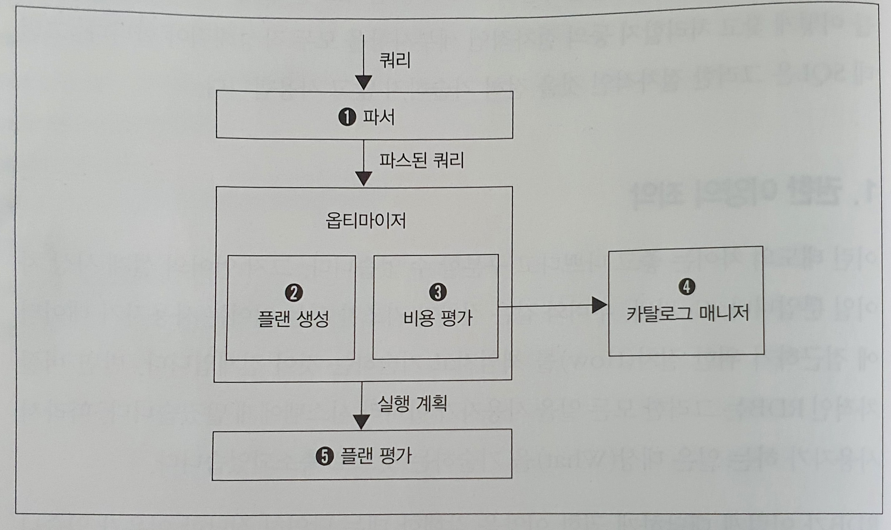
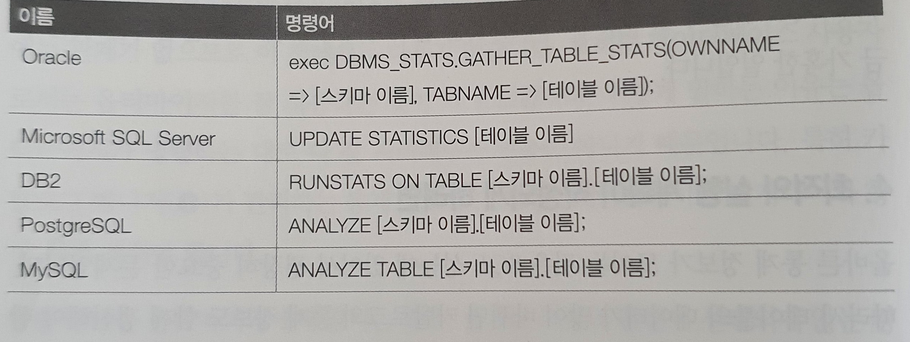

# DBMS와 실행 계획

사용자 또는 개발자가 데이터베이스에서 의식적으로 사용하는건 SQL 레벨까지다

이후의 모든 것은 SQL 구문을 읽어들인 DBMS가 알아서 처리하고 결과를 제공한다

데이터 검색에 관한 절차적인 세부사항들을 전부 작성하지 않는데 이런 측면에서 SQL을 작성 하는 것은 절차적인 것을 전혀 기술하지 않으므로 프로그래밍이라고 보기 어렵다

1. 권한 이양의 죄악
   * 이런 태도의 차이는 좋고 나쁜건 아니며 언어의 설계 사상 차이일 뿐이다
   * C, 자바, 루비와 같은 절차가 기초가 되는 언어는 사용자가 데이터에 접근하기 위한 절차(How)를 책임지고 기술하는게 전제다
   * 비절차적인 RDB는 그런 모든일을 사용자가 아닌 시스템에게 맡겨서 사용자가 하는 일은 대상(What)을 기술하는 것으로 축소되었다
     * RDB가 이렇게 권양 이양을 감행한 이유는 '비즈니스 전체의 생산성을 향상 시키기 때문'
       * 하지만 이건 RDB가 시스템 세계 곳곳에 침투한걸 봤을때는 맞는 말이지만 RDB를 다루기 어려워 하는 사람이 많다는 측면에서는 틀린말이다
       * SQL은 초기에 생각했던 것 처럼 간단한 언어가 아니며 How를 의식하지 않고 사용하는 것 때문에 성능 문제로 고생하는 경우도 생긴다
         * 따라서 RDB 내부 절차를 알아야한다
         
2. 데이터에 접근하는 방법은 어떻게 결정할까?
   * RDB에서 데이터 접근 절차를 결정하는 모듈은 쿼리 평가 엔진이라고 부른다
   * 쿼리 평가 엔진은 사용자로부터 입력받은 SQL 구문을 처음 읽어 들이는 모듈이다
   * 쿼리 평가 모듈은 추가로 파서, 옵티마이저 같은 여러개의 서브 모듈로 구성된다

#### DBMS의 쿼리 처리 흐름

* 파서(parser)
  * 파서는 사용자로부터 입력 받은 SQL 구문이 항상 구문적으로 올바르다는 보증이 없기 때문에 구문 분석을 담당 한다(이름 그대로 파스)
    * FROM 구에 존재하지 않는 테이블 이름을 쓰거나 쉼표 쓰는걸 잊은 경우 등.. 구문을 분석하여 알려준다
  * 파서는 SQL 구문을 정형적인 형식으로 변환해주어 DBMS 내부에서 일어나는 후속 처리가 효율화 되도록 해준다
    * 구문분석은 SQL에 한정되는게 아닌 일반 프로그래밍 언어의 컴파일 시점에서도 실행된다

* 옵티마이저(optimizer)
  * 파서를 통과한 쿼리는 옵티마이저로 전송된다
    * 옵티마이저의 한국어 번역은 '최적화'이며 최적화 대상은 데이터 접근법(실행계획)이다
    * 옵티마이저가 DBMS 두뇌의 핵심이다
  * 옵티마이저는 인덱스 유무, 데이터 분산 또는 편향 정도, DBMS 내부 매개변수 등의 조건을 고려해 선택 가능한 많은 실행 계획을 작성하며, 이들의 비용을 연산하고, 가장 낮은 비용을 가진 실행 계획을 선택한다
  * 접근법의 수가 많이 나온다면 그 비용을 계산하고 비교해야 하는데 사람이 하기는 굉장히 귀찮은 작업이다
    * RDB가 데이터 접근의 절차 지향 결정을 자동화하는 이유는 이런 귀찮은 일을 기계적으로 처리해주기 위해서다

* 카탈로그 매니저(catalog manager)
  * 옵티마이저가 실행 계획을 세울 때 옵티마이저에 중요한 정보를 제공하는 것이 카탈로그 매니저다
  * 카탈로그란 DBMS의 내부 정보를 모아놓은 테이블들이다
    * 테이블, 인덱스의 통계 정보가 저장되어있으며 카탈로그를 '통계 정보'라고 부르기도 한다

* 플랜 평가(plan evaluation)
  * 옵티마이저가 SQL 구문에서 여러 개의 실행 계획을 세운 뒤 그것을 받아 최적의 실행 결과를 선택하는게 플랜 평가다
    * 실행계획은 곧바로 DBMS가 실행할 수 있는 형태의 코드가 아니며 오히려 인간이 읽기 쉽게 만들어진 문자 그대로의 계획서다
      * 따라서 성능이 좋지 않은 SQL 구문이 있을 때 실행 계획을 읽고, 수정 방안 등을 고려할 수 있다
      * 하나의 실행 꼐획을 선택하면 이후에 DBMS는 실행 계획을 절차적인 코드로 변환하고 데이터 접근을 수행한다

3. 옵티마이저와 통계 정보
   * 위 내용이 DBMS가 쿼리를 읽어들여 실제로 데이터 접근을 수행할 때까지의 흐름이다
     * 옵티마이저 내부에서 일어나는 처리는 엔진 자체를 구현하는 엔지니어 이외에는 관계가 없으므로 이 책에서는 다루지 않으며 오히려 데이터베이스 사용자로서는 옵티마이저를 잘 사용하는게 더 중요하다
   * 옵티마이저는 명령하는대로 다 잘 처리해주는 만능은 아니다
   * 카탈로그 매니저가 관리하는 통계 정보에 대해서는 데이터베이스 엔지니어가 항상 신경을 써야한다
   * 플랜 선택을 옵티마이저에게 맡기는 경우 최적의 플랜이 선택되지 않는 경우가 빈번하다
     * 옵티마이저가 실패하는 패턴이 몇 가지 있는데 그 중 통계 정보가 부족한 경우가 대표적이다
     * 구현에 따라 차이는 있지만 카탈라고으ㅔ 포함되어 있는 통계 정보는 아래와 같다
       * 각 테이블의 레코드 수
       * 각 테이블의 필드 수와 필드의 크기
       * 필드의 카디널리티(값의 개수)
       * 필드값의 히스토그램(어떤 값이 얼마나 분포되어 있는가)
       * 필드 내부에 있는 NULL 수
       * 인덱스 정보
     * 이런 정보를 활용해 옵티마이저는 실행 계획을 만들며 문제가 생기는 경우는 이런 카탈로그 정보가 테이블 또는 인덱스의 실제와 일치하지 않는 경우다
     * 테이블에 데이터 삽입/갱신/제거가 수행될 때 카탈로그 정보가 갱신되지 않는다면 옵티마이저는 오래된 정보를 바탕으로 실행계획을 세우고 과거 정보를 가지고 있기 때문에 잘못된 계획이 세워진다
     
4. 최적의 실행 계획이 작성되게 하려면
   * 올바른 통계 정보가 모이는건 SQL 성능에 있어서 굉장히 중요한 문제다
     * 테이블의 데이터가 많이 변하면 카탈로그의 통계 정보도 함께 갱신해야 한다는건 DB엔지니어의 상식이다
   * 수동으로 갱신하는것 뿐만 아니라 데이터를 크게 갱신하는 배치 처리가 있을 때는 Job Net을 조합하는 경우도 있다
     * Job Net : 각각의 작업의 실행 순서를 나타낸다
     * Oracle 처럼 기본 설정에서 정기적으로 통계 정보 갱신 작업이 수행되는 경우도 있고 Microsoft SQL Server 처럼 갱신 처리가 수행되는 시점에 자동으로 통계 정보를 갱신하는 DBMS도 있다

#### 대표적인 DBMS의 통계 정보 갱신 명령어

      

    