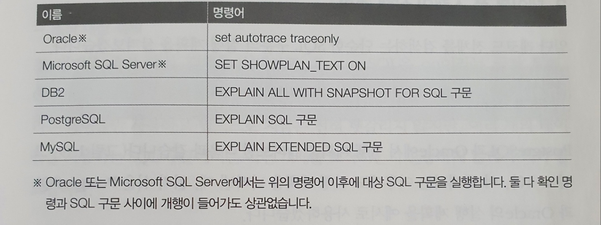
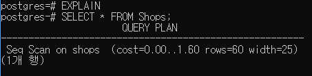

# 실행 계획이 SQL 구문의 성능을 결정

실행 계획이 만들어지면 DBMS는 그걸 바탕으로 데이터 접근을 수행한다
* 하지만 데이터양이 많은 테이블에 접근하거나 복잡한 SQL 구문을 실행하면 반응 지연이 발생하는 경우가 꽤 있다
  * 통계 정보가 부족한 경우도 있지만 최적의 경로가 설정되어 있는데도 느린 경우도 있다
  * 통계 정보가 최신이라도 SQL 구문이 너무 복잡하면 옵티마이저가 최적의 접근 경로를 선택하지 못 할 수도 있다

1. 실행 계획 확인 방법
   * SQL 구문의 지연이 발생한 경우 제일 먼저 실행 계획을 살펴봐야 한다
     * 모든 DBMS는 실행 계획을 조사하는 수단을 제공한다
#### 실행계획을 확인하는 명령어
     

2. 테이블 풀 스캔의 실행 계획

``` sql
레코드 전체를 검색하는 단순한 SQL 구문의 실행 계획

EXPLAIN - 실행계획 확인 명령어

SELECT * FROM Shops; - 실행계획을 확인 대상 쿼리
```
#### 테이블 풀 스캔의 실행 계획(PostgreSQL)


oracle과 postgreSQL의 실행 계획이 완전히 같지는 않지만 아래와 같이 3가지 공통적인 부분이 있다

1. 조작 대상 객체
2. 객체에 대한 조작의 종류
3. 조작 대상이 되는 레코드 수

이런 3가지 내용은 거의 모든 DBMS의 실행 계획에 포함되어 있다
* 그만큼 중요한 부분이다

* 조작 대상 객체
  * 조작 대상 객체를 보면 PostgreSQL은 on이라는 글자 뒤에 Oracle은 Name 필드에 Shops 테이블이 출력됩니다
    * 샘플의 SQL 구문이 Shops라는 테이블만 사용하고 있어 헷갈리지 않지만 여러 테이블을 사용하면 헷갈릴 가능성이 있어 주의가 필요하다
    * 또한 이 부분에는 테이블이 아닌 인덱스, 파티션, 시퀀스처럼 SQL 구문으로 조작할 수 있는 객체라면 무엇이든 가능하다

* 객체에 대한 조작의 종류
  * 객체에 대한 조작의 종류는 실행 계획에서 가장 중요한 부분이다
    * PostgreSQL은 문장의 앞부분에 나오며 Oracle에서는 Operation 필드로 나타난다
      * PostgreSQL의 Seq Scan은 순차적인 접근(Sequential Scan)의 줄임말로 파일을 순차적(Sequential)으로 접근해서 해당 테이블의 데이터 전체를 읽어낸다는 뜻이다
      * Oracle의 TABLE ACCESS FULL은 테이블의 데이터를 전부 읽어들인다는 뜻이다
        * 사실 두가지가 같은것은 아니지만 Oracle도 테이블 풀 스캔을 할때 내부적으로 시퀀셜 스캔을 수행하므로 같다고 생각해도 상관은 없다
        * 테이블에서 데이터를 모두 읽은 방법으로 반드시 시퀀셜 스캔을 선택할 이유는 없기 때문에 PostgreSQL의 출력이 조금 더 물리적 차원에 가깝다

* 조작 대상이 되는 레코드 수
  * 두가지 DBMS 모두 row라는 항목에 출력된다
  * 결합 또는 집약이 포함되면 1개의 SQL 구문을 실행해도 여러 개의 조작이 수행된다
    * 각 조작에서 얼마만큼의 레코드가 처리되는지가 SQL 구문 전체의 실행 비용을 파악하는데 중요한 지표가 된다
  * 이 숫자와 관련된 자주 생기는 오해가 있다
    * 이 숫자는 옵티마이저가 실행 계획을 만들 때 설명했던 카탈로그 매니저로부터 얻은 값이다
    * 즉 통계 정보에서 파악한 숫자이며 실제 SQL 구문을 실행한 시점의 테이블 레코드 수와 차이가 있을 수 있다
      * JIT을 사용하는 경우는 차이가 없다

3. 인덱스 스캔의 실행 계획

``` sql
이전에 실행했던 간단한 SQL 구문에 WHERE 조건을 추가

EXPLAIN

SELECT * FROM Shops WHERE shop_id = '00050';
```

