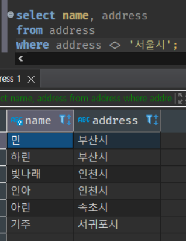
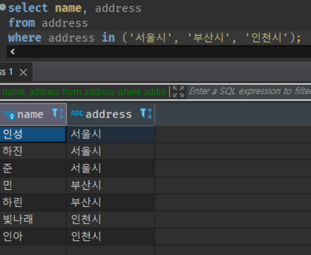

# chap 02 SQL 기초

 

RDB는 데이터를 관계(relation)라는 형식으로 저장한다. 구현으로는 이를 테이블(table)이라고 부른다.

SQL은 테이블을 검색해서 데이터를 검색하거나 갱신할 때 사용하는 언어이다.

## 6강 - 1 SELECT 구문

- 데이터베이스를 이용하는 때 핵심이 되는 처리가 바로 **검색**이다. 검색은 데이터가 저장되어 있는 테이블에서 필요한 데이터를 뽑아내는 것이다. 다른 말로는 **질의(query)**라던지 **추출(retrieve)**이라고 부른다.

- 검색을 위해 사용하는 SQL 구문을 SELECT 구문이라고 부른다. 문자 그대로 **선택**한다는 것이다.

### 1. SELECT 구와 FROM 구

* SELECT 구문은 두 개의 부분으로 구성되어 있다. 첫 번째는 SELECT 뒤에 나열되어 있는 부분으로, SELECT 구라고 부른다.
* 두 번째 부분은 'FROM[테이블 이름]'으로 FROM 구라고 부르며, 데이터를 선택할 대상 테이블을 지정한다. 반드시 입력해야 하는 것은 아니나, 테이블에서 데이터를 검색할 때는 반드시 입력해야 한다. 
* 이 주속록에서 모든 사원을 선택하는 SQL구문은 가장 간단한 SQL 구문이지만, 이런 간단한 샘플 내부에서도 이미 SQL 의 특성이 암묵적으로 나타난다. 
* 이는 SELECT 구문에는 데이터를 '어떤 방법으로' 선택할지 일절 쓰여 있지 않다는 것이다. 이 방법(= 절차 지향)은 DBMS에게 맡기게 된다. '최대한 쉽게 만드는 것'이 RDB의 기본 정신이다. 
* 사용자가 생각해야 하는 것은 어떤 데이터가 필요한지 정도이다. 그 이외의 것은 모두 DBMS라는 하인에게 맡기면 된다. 

### 2. WHERE 구

* SELECT 구문에는 레코드를 선택할 때 추가적인 조건을 지정할 수 있는 방법이 있다. 이를 WHERE 구라고 부른다. 

코드 2-2 WHERE 구로 검색 내용을 압축

*이러한 처리는 엑셀의 '필터 조건'을 사용하는 것과 같다. 이때 WHERE라는 단어를 사용하는 것이 이상하다고 생각할 수 있다. 
이때의 WHERE은 '어디?'를 나타내는 의문사가 아니라, '~라는 경우'를 나타내는 관계부사이다. 

#### WHERE구의 다양한 조건 지정
WHERE구는 예제에서 사용한 '='와 같은 동일 조건뿐만 아니라, 더 다양한 조건 지정이 가능하다. 

| 연산자 | 의미       | 
|-----|----------| 
| =   | ~와 같음    | 
| <>  | ~와 같지 않음 |
| >=  | ~이상      |
| >   | ~보다 큼    |
| <=  | ~이하      |
| <   | ~보다 작음   |

코드 2-3 나이가 30세 이상

 

코드 2-4 주소가 서울시 이외

#### WHERE 구는 거대한 벤다이어그램 
두 개의 조건을 연결하는 '그리고'는 'AND'를 사용한다. 

코드 2-5 AND는 집합의 공유 부분을 선택

이렇게 하면 두 개의 조건을 모두 만족하는 레코드만 선택한다. 이러한 복합 조건을 이해할 때는 

벤다이어 그램을 생각해주면 좋다. 벤다이어그램은 중고등학교 때 집합을 공부하면서 살펴본 원을 말한다. 

그림 2-2 벤다이어그램으로 나타낸 AND 연산

'그리고'에 상응하는 'AND'가 있으므로, '또는'에 상응하는 'OR'도 당연히 있을 것이다. 

코드 2-6 OR은 집합의 합집합을 선택 

벤다이어그램으로 표현하면 다음과 같다. '합집합'이라고 할 수 있다. 

* 지금까지 살펴본 것처럼 WHERE 구라는 것은 벤다이어그램을 그리기 위한 도구이다. WHERE구에 복잡한 조건을 지정할 때 
벤다이어그램을 그려보면 쉽게 이해할 수 있을 것이다. 

#### IN으로 OR 조건을 간단하게 작성 

* 이렇게 SQL에서는 AND/OR를 사용해 다양한 조건을 지정할 수 있다. 상황에 따라서는 OR 조건을 굉장히 많이 지정해야 할 때가 있을 수 있다. 

코드 2-7 OR조건을 여러 개 지정 

* 이렇게 3개 정도라면 OR로 나열해도 괜찮다. 하지만 몇십 개의 조건을 나열해야 한다면, 작성하기도 힘들고 보기도 좋지 않다. 

* SQL은 이러한 때 조건을 간단하게 작성할 수 있게 도와주는 IN이라는 도구를 제공한다. 

코드 2-8 IN을 사용한 방법

실행 결과는 이전과 같지만 WHERE 구가 굉장히 깔끔하게 바뀌었다. 

### NULL - 아무것도 아니라는 것은 무엇일까? 

* WHERE구로 조건을 지정할 때, 초보자가 처음 곤란해 하는 부분이 바로 NULL을 검색할 때이다. 

* 지금 address 테이블에 전화번호가 없는 (=NULL)사람이 2명 있다. 이 사람들만 선택하는 조건을 만들고 싶다면 어떻게 하면 될까? 

코드 2-9 제대로 실행되지 않는 SELECT 구

* 제대로 작동하는 SELECT 구문이 아니다. 물론 오류가 발생하지도 않는다. 다만 결과로 아무것도 나오지 않는다. 

* NULL 레코드를 선택할 때는 'IS NULL'이라는 특별한 키워드를 사용해야 한다. 

코드 2-10 제대로 작동하는 SELECT 구문

* 반대로 NULL이 아닌 레코드를 선택하고 싶은 경우에는 'IS NOT NULL'이라는 키워드를 사용한다. 이를 사용해 코드를 작성하면 이전의 반대의 결과가 나온다. 

* 일단 그냥 NULL은 이렇게 다룬다고 외우는 것이 편하다. NULL 데이터를 선택할 때 '=NULL'과 같은 코드를 사용하지 않는 데이는 이유가 있지만 조금 복잡하다.
NULL을 다루는 것은 RDB에서 많은 사람들을 곤란하게 만드는 문제 중에 하나인데, 일단 'IS NULL'과 'IS NOT NULL'을 사용한다는 것만 알아두면 어느 정도 문제없을 것이다. 

