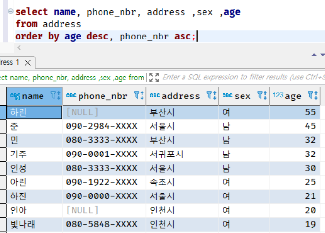
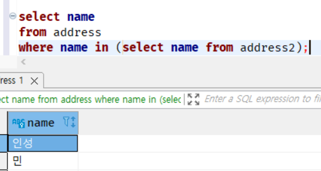

# chap 02 SQL 기초

 

## 6강 - 2 SELECT 구문

### 3. GROUP BY 구

* GROUP BY 구를 사용하면, 테이블에서 단순하게 데이터를 선택하는 것뿐만 아니라 합꼐 또는 평균 등의 집계 연산을
SQL구문으로 할 수 있다. 

* GROUP BY 구의 기능을 쉽게 표현하면 '테이블을 홀 케이크처럼 다룬다'라고 할 수 있다. 물론 많이 먹는 사람이라면 
혼자서도 다 먹을 수 있겠지만, 칼이라는 도구를 사용해 케이크를 자르고 많은 사람이 나눠 먹는 것이 일반적이다. 
GROUP BY 구는 **이때 케이크를 자르는 칼과 같은 역할을 한다.**

#### - 그룹을 나누었을 때의 장점

* 일단 잘라진 케이크 조각을 **그룹**이라고 부른다. 그리고 이러한 그룹은 다양한 숫자 관련 함수를 사용한 집계가 가능하다. 

어떠한 집계가 가능한지 SQL의 대표적인 함수를 5개 살펴보자

| 함수 이름 | 설명         | 
|-------|------------| 
| COUNT | 레코드 수를 계산  | 
| SUM   | 숫자를 더함     |
| AVG   | 숫자의 평균을 구함 |
| MAX   | 최댓값을 구함    |
| MIN   | 최솟값을 구함    |

남자그룹과 여자 그룹에 각각 몇 명이 있는지 구하고 싶을 때는 다음과 같은 SELECT 구문을 사용한다. 

코드 2-11 성별 별로 사람 수를 계산

살고 있는 지역을 기준으로 케이크를 자른다면 다음과 같이 자를 수 있다. 

그림 2-5 케이크를 주소로 자르기 

코드 2-12 주소별로 사람수를 계산 

홀 케이크를 혼자 먹는 경우도 있을 수 있다.이런 경우는 케이크를 자르지 않고 먹는다. 
따라서 GROUP BY 구를 사용할 때 키를 지정하지 않으면 된다. 이렇게 하면 테이블 전체(= 케이크 전체)를 하나의 조각으로 
생각해서 함수를 적용할 수 있다. 

그림 2-6 케이크를 자르지 않고 먹기

코드 2-13 전체 인원수를 계산

GROUP BY 구의 '()'는 키를 지정하지 않는다는 뜻이다. 보통 이러한 경우는 GROUP BY 구 자체를 생략하는 일이 많다. 

두 가지 모두 실행결과는 완전히 같지만 생략하는 형태가 많이 사용된다. 일부 DBMS에서는 group by (); 를 지원하지 않는다.

### 4. HAVING 구

코드 2-12에서 5개의 집합을 얻었다. SQL은 그러한 결과 집합에 또다시 조건을 걸어 선택하는 기능이 있다. 
사용방법은 WHERE 구로 레코드를 선택하는 것과 거의 같다. 이번에는 HAVING 이라는 영어 단어를 사용한다. 

살고 있는 사람수(레코드 수)가 한 명뿐인 주소 필드(address)를 선택하고 싶다면 아래와 같이 작성한다. 

코드 2-14 한 사람밖에 없는 주소를 선택 

이렇게 HAVING 구를 사용하면 선택된 결과 집합에 또다시 조건을 지정할 수 있다. 즉 WHERE 구가 '레코드'에 조건을 지정한다면,
HAVING 구는 '집합'에 조건을 지정하는 기능이라고 할 수 있다. 

HAVING 구는 SQL이 가진 굉장히 강력한 기능 중 하나로, 다양하게 응용할 수 있다. 

### 5. ORDER BY 구

지금까지 레코드들은 대체 어떤 순서로 출력된걸까? 

간단하게 말하면 '엉터리로 출력한다'이다. 순화해서 '딱히 정해진 규칙은 없다'라고 말할 수 있다. 

모든 DBMS에서 SELECT 구문의 결과 순서를 보장하려면 명시적으로 순서를 지정해줘야 한다. 

이때 ORDER BY 구를 사용한다. 

Address 테이블에서 모든 레코드를 선태갛고 나이가 많은 순서로 레코드를 정렬하고 싶다면 다음과 같이 작성한다. 

코드 2-15 나이가 많은 순서로 레코드를 정렬

'DESC'는 Descending Order(내림차순)을 나타낸다. 반대로 오름차순은 'ASC(Ascending Order)'라는 키워드를 사용한다. 
오름차순의 경우는 SQL의 기본설정으로 따로 ASC 키워드를 사용할 필요 없다. 이는 모든 DBMS의 공통 규칙이다. 

실행 결과를 보면 32세의 사람이 두 명 있다.(기주와 민) 이 사람들의 순서도 DBMS마다 다를 수 있다. 이 순서도 맞추고 싶다면 정렬 키를 추가해서 
정렬 순서를 지정해줘야 한다. 예를 들어 'ORDER BY age DESC, phone_nbr ASC'라고 하면 전화번호 순서까지 적용되어 민이 위로 오게 된다.

### 6. 뷰와 서브쿼리

자주 사용하는 SELECT 구문은 텍스트 파일에 따로 저장해 놓아도 좋을 것이다. 하지만 사용자가 직접 텍스트 파일을 관리한다면 파일을 지워버리거나 덮어 씌워버릴 수 있다. 

이럴 때 SELECT 구문을 데이터베이스 안에 저장할 수 있따면 편리할 것이다. 그 기능이 바로 **뷰(View)** 이다. 

뷰는 데이터베이스 안에 저장한다는 점은 테이블과 같다. 하지만 테이블과 달리 내부에 데이터를 보유하지 않는다. 

어디까지난 뷰는 'SELECT 구문'을 저장한 것뿐이다. 

#### - 뷰 만드는 방법
뷰를 만들려면 저장하고 싶은 SELECT구문을 다음 문장에 이어서 작성한다. 

> CREATE VIEW [뷰 이름] ([필드 이름1], [필드 이름2] ...) AS

예를 들어 주소별 사람수를 구하는 SELECT 구문을 뷰로 저장해보자.

코드 2-16 뷰 생성

이렇게 만들어진 뷰는 일반적인 테이블처럼 SELECT 구문에서 사용할 수 있다. 

코드 2-17 뷰 사용 

이렇게 뷰라는 것은 '테이블의 모습을 한 SELECT구문'이라고 말할 수 있다. 

#### - 익명 뷰

뷰는 사용방법이 테이블과 같지만 내부에는 데이터를 보유하지 않는다는 점이 테이블과 다르다. 따라서 뷰에서 데이털를 선택하는 SELECT 구문은,
실제로는 내부적으로 '추가적인 SELECT구문'을 실행하는 중첩(nested) 구조가 되는 것이다. 

코드 2-18 뷰는 SELECT 구문이 중첩되어 있는 구조

* 앞의 코드는 뷰를 사용하는 경우와 뷰의 내용을 SELECT 구문으로 전개했을 때의 코드이다. 이렇게 뷰 대신 FROM 구에 직접 SELECT 구문을 지정할 수도 있다. 

* 이렇게 FROM 구에 직접 지정하는 SELECT구문을 **서브쿼리(subquery)** 라고 부른다. 

#### - 서브쿼리를 사용한 편리한 조건 지정

서브쿼리를 사용할 때 중요한 것을 한 가지 살펴보겠다. 바로 WHERE 구의 조건에 서브쿼리를 이용하는 방법이다. 

Address2 테이블을 만들고 Address 테이블과 공통되는 데이터도 삽입하였다. 

이 두 테이블을 사용해 'Address 테이블에서 Address2 테이블에 있는 사람을 선택'하는 문장을 SQL로 만들어보자. 
이런 처리를 **매칭(matching)** 이라고 부른다. 

이런 경우 편리하게 활용할 수 있는 것이 앞에서 설명한 'IN으로 OR 조건을 간단하게 작성'에서 배웠던 IN이다. 
IN 은 이전에 살펴본 예제처럼 상수를 매개변수로 받는 것뿐만 아니라, 서브쿼리를 매개변수로도 받을 수 있다. 

코드 2-19 IN 내부에서 서브쿼리 사용

SQL은 서브쿼리부터 순서대로 실행한다. 따라서 앞의 SELECT 구문을 받은 DBMS는 서브쿼리를 상수로 전개해서 
바꾼다. 

코드 2-20 서브쿼리를 전개해서 실행

이러한 IN과 서브쿼리를 함께 사용하는 구문은 데이터가 변경되어도 따로 수정할 필요가 없다는 점에서 굉장히 편리하다. 

예를 들어 상수를 직접 입력 (이를 **하드코딩** 이라고 부른다)하면 Address2 테이블의 데이터가 바뀔 때마다 SELECT 구문을 수정해야 한다. 

하지만 서브쿼리를 이용하면 IN 내부의 서브쿼리가 SELECT 구문 전체가 실행될 때마다 다시 실행된다. 따라서 동적으로 상수 리스트를 생성하게 되어

Address2 테이블의 데이터가 바귀어도 알아서 처리해준다. 