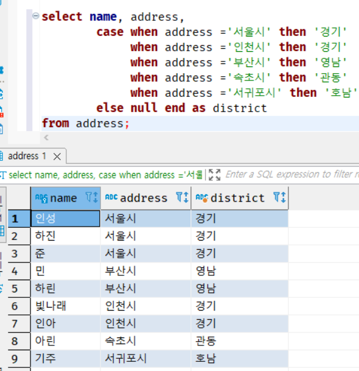
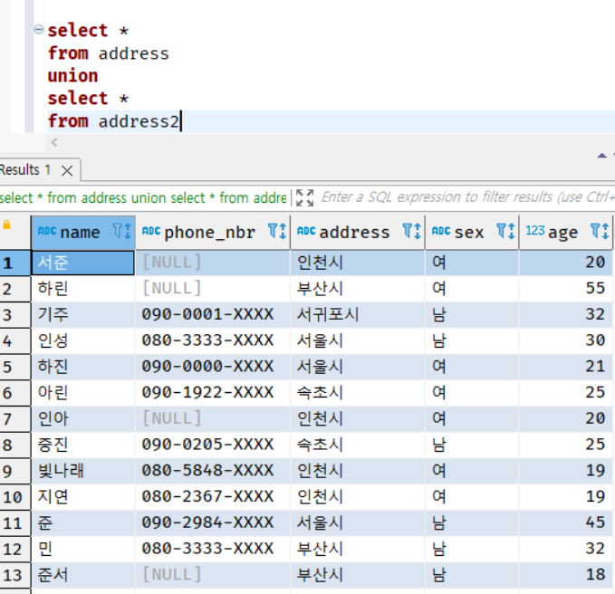
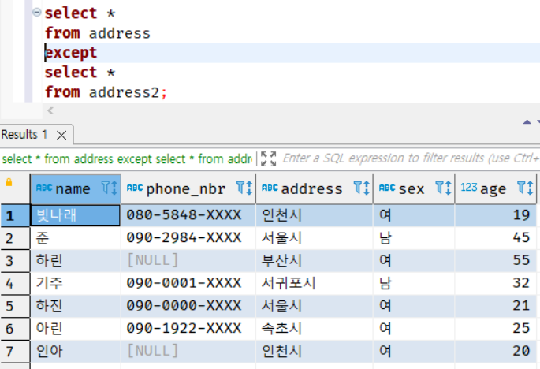

# chap 02 SQL 기초

<br>

## 7강 - 조건 분기, 집합 연산, 윈도우 함수, 갱신


### 1. SQL과 조건 분기

* 일반적인 절차 지향형 프로그래밍 언어에는 조건 분기를 사용하기 위한 수단으로 if 조건문과 switch 조건문 등이 있다. 
조건문은 굉장히 중요한 기능이므로 조건문 없이 개발하라는 것은 있을 수 없는 일이다. 

* SQL에도 이처럼 조건 분기를 하는 방법이 있지만 사용 방법이 약간 다르다. SQL은 코드를 절차적으로 기술하는 것이 아니므로 
조건 분기를 '문장' 단위로 하지 않기 때문이다. 

* 그렇다면 SQL의 조건 분기는 어떤 단위를 기준으로 할까? 바로 '식'이다. 그리고 이런 식의 분기를 실현하는 기능이 바로 CASE 식이다. 
SQL 프로그래밍 중급 이상으로 올라가려면 반드시 이해해야 하는 것이 바로 이 CASE 식이다. 


#### - CASE 식의 구문

* CASE 식의 구문에는 '단순 CASE 식'과 '검색 CASE 식'이라는 두 종류가 있다. 
다만 검색 CASE 식은 단순 CASE 식의 기능을 모두 포함하고 있으므로 검색 CASE 식만 기억해도 충분하다. 

코드 2-21 검색 CASE 식의 구문

```sql
CASE WHEN [평가식] THEN [식]
     WHEN [평가식] THEN [식]
     WHEN [평가식] THEN [식]
     생략
     ELSE [식]
END
```

* WHEN 구의 평가식이라는 것은 '필드=값'처럼 조건을 지정하는 식을 말한다. WHERE 구에 조건을 작성하는 방법은 다음과 같다. 

#### - CASE 식의 작동

* CASE 식의 작동은 절차 지향형 프로그래밍 언어의 switch 조건문과 거의 비슷하다. 
처음에 있는 WHEN 구의 평가식부터 평가되고 조건이 맞으면 THEN 구에서 지정한 식이 리턴되며 CASE 식 전체가 종료된다. 

* 만약 조건이 맞지 않으면 다음 WHEN 구로 이동해 같은 처리를 반복한다. 마지막 WHEN 구까지 반복했는데도 조건이 맞는 경우가 없다면 
'ELSE'에서 지정한 식이 리턴되며 끝난다. 

* 절차 지향형 언어의 조건 분기와 SQL 조건 분기 사이의 가장 큰 차이점?

    * 바로 리턴값이다. 절차 지향형 언어의 조건 분기는 문장을 실행하고 딱히 리턴하지는 않는다. 
    반면 SQL 조건 분기는 특정한 값(상수)를 리턴한다.  


* 주소의 결과 표시를 시도의 이름이 아니라 '경기', '관동', '호서', '영남'처럼 분류하는 경우를 생각해보자.

코드 2-22  시도의 이름을 큰 지역으로 구분하는 CASE 식



* 이 코드는 일종의 교환이라고 말할 수 있다. '서울시 → 경기', '부산시 → 영남'처럼 교환되었다. 일반적으로 CASE 식은 이러한 경우에 많이 사용된다. 

* CASE 식의 강력한 점은 **식** 이라는 것이다. 따라서 식을 적을수 있는 곳이라면 어디든지 적을 수 있다. 
SELECT, WHERE, GROUP BY, HAVING, ORDER BY 구와 같은 곳 어디에나 적을 수 있으므로 다양한 기법으로 활용할 수 있다. 

* CASE 식은 SQL의 성능과도 굉장히 큰 관련이 있으므로 이후에도 계속해서 등장한다. 꼭 기억하기 바란다.

<hr>

### 2. SQL의 집합 연산

* WHERE 구를 설명할 때, 벤다이어그램을 사용한 집합 연산이라고 이야기했다. 이는 그냥 예로 들었던 것이다. 
SQL에는 정말로 테이블을 사용해 집합 연산하는 기능이 있다. 

#### - UNION으로 합집합 구하기

* 집합 연산의 기본은 합집합과 교집합이다. WHERE 구에서는 합집합을 OR가, 교집합은 AND가 담당했었다. 
하지만 집합 연산에서는 연산자가 다르다. UNION(합)이라는 연산자를 사용한다. 

코드 2-23 UNION으로 합집합 구하기



문자 그대로 두 개의 테이블을 하나의 테이블로 합친 결과가 나온다. 

* 특이한 점은 두 테이블 합쳐서 총 15개의 레코드지만 13개의 레코드가 나왔다. 그 이유는 양쪽 테이블에 중복해서 존재하는 인성과 민의 중복을 막았기 때문이다. 

* UNION은 합집합을 구할 때 이렇게 중복된 레코드를 제거한다. 이는 UNION만 그런 것이 아니라 이후에 살펴보는 INTERSECT와 EXCEPT 등에서도 같다. 
만약 중복을 제외하고 싶지 않다면 'UNION ALL'처럼 ALL 옵션을 붙이면 된다.

#### - INTERSECT로 교집합 구하기 

* AND에 해당하는 교집합을 구해보겠다. 교집합을 구할 때 사용하는 연산자는 INTERSECT로 '교차'라는 의미이다. 

코드 2-24 INTERSECT로 교집합 구하기 


* 양쪽 테이블에 공통으로 존재하는 레코드를 출력하므로 인성과 민만 출력된다. 
 이전과 마찬가지로, 중복되는 것이 있다면 해당 레코드는 제외된다는 것을 기억하자.

#### - EXCEPT로 차집합 구하기

* 마지막으로 소개할 연산자는 차집합을 수행하는 EXCEP 연산자로 제외라는 의미이다. 

코드 2-25 EXCEPT로 차집합 구하기



* 이를 수식으로 나타내면 'Address - Address2'가 된다. 결과적으로 Address테이블에서 인성과 민이라는 두 개의 레코드가 제거된 결과를 얻을 수 있다. 

* 이때 EXCEPT에는 UNION과 INTERSECT에는 없는 주의사항이 있다. UNION과 INTERSECT는 어떤 테이블을 먼저 적든 그 순서와 상관없이 결과가 같습니다. 
하지만 EXCEPT의 경우는 결과가 다르다. 

* 이는 숫자의 사칙 연산과 같은 성질이다. 덧셈 연산은 '1+5'와 '5+1'의 결과가 같습니다. 이러한 것을 '교환 법칙이 성립한다'라고 부른다.
뺄셈 연산은 '1-5'와 '5-1'의 결과가 다르다. 따라서 뺄셈 연산은 '교환 법칙이 성립하지 않는다'이다. 

