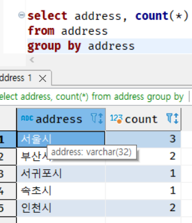

# chap 02 SQL 기초

<br>

## 7강 - 조건 분기, 집합 연산, 윈도우 함수, 갱신

### 3. 윈도우 함수

* 윈도우 함수도 굉장히 중요한 기능이다. 윈도우 함수는 데이터를 가공하게 해준다는 점에서도 중요하지만, 이 책의 주제인
성능과 큰 관계가 있다. 

* 윈도우 함수의 특징을 한마디로 정리하면 '집약 기능이 없는 GROUP BY 구'이다. 이전에 살펴보았던 GROUP BY 구는 **자르기**와 **집약**이라는 두 개의 기능으로 구분된다. 
윈도우 함수는 여기서 **자르기** 기능만 있는 것이다. 


코드 2-26 GROUP BY로 주소별 사람수를 계산하는 SQL 구문 (다시 게재)




* 이 SQL은 일단 address 필드로 테이블을 (케이크처럼) 자르고, 이어서 잘라진 조각 개수만큼의 레코드 수를 더해 결과를 출력한다. 
이때 출력 결과의 레코드 수는 Address 테이블에 포함되어 있는 지역 수인 5개가 된다. 

* 윈도우 함수도 테이블을 자르는 것은 GROUP BY 와 같다. 윈도우 함수는 이를 'PARTITION BY'라는 구로 수행한다. 
차이점이 있다면 자른 후에 집약하지 않으므로 출력 결과 레코드 수가 입력되는 테이블의 레코드 수와 같다는 것이다. 

* 윈도우 함수의 기본적인 구문은 집약 함수 뒤에 OVER 구를 작성하고, 내부에 자를 키를 지정하는 PARTITION BY 또는 ORDER BY를 입력하는 것이다. 
작성하는 장소는 SELECT 구라고만 생각해도 문제 없다.  

코드 2-27 윈도우 함수로 주소별 사람수를 계산하는 SQL


* GROUP BY의 결과와 비교하자. 속초시에 1명, 인천시에 2명이라는 지역별 사람수는 양쪽 모두 같다.
하지만 출력되는 결과의 레코드 수가 다르다. 윈도우 함수에서는 테이블의 레코드 수와 같은 9개이다.
이는 집약 작업이 수행되지 않았기 때문이다. 이전에 말했던 '윈도우 함수는 GROUP BY에서 자르기 기능만 있는 것'이라는 게 바로 이 의미이다.

* 윈도우 함수로 사용할 수 있는 함수로는 COUNT 또는 SUM 같은 일반 함수 이외에도, 윈도우 함수 전용 함수로 제공되는 
RANK 또는 ROW_NUMBER 등의 순서 함수가 있다. 예를 들어 RANK 함수는 이름 그대로 지정된 키로 레코드에 순위를 붙이는 함수이다. 

코드 2-28 윈도우 함수로 순위 구하기 


* RANK 함수는 숫자가 같으면 같은 순위로 표시하므로 32세인 기주와 민이 함께 3위로 순위가 매겨진다. 
그리고 4위를 건너 뛰고 인성이 5위가 되는데요. 만약 이런 건너뛰는 작업 없이 순위를 구하고 싶을 때는 DENSE_RANK 함수를 사용한다. 

코드 2-29 윈도우 함수로 순위 구하기(건너뛰기 없음)


### 4. 트랜잭션과 갱신

* SQL은 'Structured Query Language'의 약자이다. 'Query'는 '질의'를 나타내며 좁은 뜻으로는 SELECT 구문을 나타낸다.
이름에서 알 수 있듯 SQL은 처음부터 데이터 검색을 중심으로 수행하기 위한 언어이다. 한마디로 데이터를 갱신하는 것은 부가적인 기능이라는 것이다. 

* 역사적으로도 SQL의 검색기능은 점점 추가되면서 복잡해졌다. 하지만 갱신 기능은 딱히 복잡하지 않다.
SQL의 갱신 기능은 굉장히 쉬우므로 이해하기 어렵지 않다. 

* 기본적으로 SQL의 갱신 작업은 다음과 같이 세 종류로 분류한다. 
    1. 삽입(insert)
    2. 제거(delete)
    3. 갱신(update)
* 이 이외에도 1과 3을 합친 머지(MERGE)라는 갱신 기능도 있지만, 일단은 위의 3개 기능으로 구분된다고 이해하자. 

#### - INSERT로 데이터 삽입

* RDB는 데이터를 테이블에 보관한다. 테이블은 당연히 만드는 시점에는 내부에 아무것도 없다. 
테이블은 데이터를 보관하는 상자에 지나지 않으므로 내부에 데이터가 없으면 사용하는 의미가 없다. 

* RDB에서 데이터를 등록하는 단위는 레코드(행이라고도 부른다)이다. 기본적인 등록 단위는 하나의 레코드씩이다. 
이때 사용하는 것이 INSERT 구문인데, 문자 그대로 레코드를 '삽입'한다. 

그림 2-9 기본적인 INSERT 구문

```sql
INSERT INTO [테이블 이름] ([필드1],[필드2], [필드3]...)
            VALUES ([값1], [값2], [값3]...);
```

* 이때 필드 리스트와 값 리스트는 같은 순서로 대응하게 입력해야 한다. 순서가 다르면 오류가 발생하거나 원하는 값이 
들어가지 않으므로 주의하기 바란다. 

코드 2-30 인성을 Address 테이블에 추가

```sql
INSERT INTO Address (name, phone_nbr, address, sex, age)
            VALUES('인성', '080-3333-XXXX', '서울시', '남', 30);
```
* 또한 name 필드, address 필드의 값은 '인성' 또는 '서울시'처럼 작은따옴표(싱글쿼트)로 값을 감싸고 있다.
문자열 자료형의 데이터에는 반드시 입력해야 한다. 반대로 age 필드처럼 숫자 자료형의 경우에는 감싸지 않는다. 

* 추가로 NULL을 삽입하는 경우는 그대로 NULL을 입력한다. 이때도 NULL을 작은따옴표로 감싸면 안 된다. 
NULL을 작은따옴표로 감싸버리면 문자열로 인식하기 때문이다. 

* 테이블에 데이터를 삽입하는 INSERT 구문은 기본적으로 레코드를 하나씩 삽입한다. 
100개의 레코드를 삽입한다고 100개의 구문을 실행하는 것은 합리적이지 않다.
최근에는 여러 개의 레코드를 한 개의 INSERT 구문으로 삽입하는 기능(multi-row insert)을 지원하는 DBMS도 있기 때문이다. 

코드 2-31 9개의 레코드를 한 번에 추가
```sql
INSERT INTO Address (name, phone_nbr, address, sex, age)
              VALUES('인성', '080-3333-XXXX', '서울시', '남', 30),
              ('하진', '090-0000-XXXX', '서울시', '여', 21),
              ('준', '090-2984-XXXX', '서울시', '남', 45),
              ('민', '080-3333-XXXX', '부산시', '남', 32),
              ('하린', NULL, '부산시', '여', 55),
              ('빛나래', '080-5848-XXXX', '인천시', '여', 19),
              ('인아', NULL, '인천시', '여', 20),
              ('아린', '090-1922-XXXX', '속초시', '여', 25),
              ('기주', '090-0001-XXXX', '서귀포시', '남', 32);
```

* 이 방법은 간단하고 한 번만 구문을 실행하면 된다는 점에서 좋다. 하지만 모든 DBMS에서 사용할 수 있는 것이 아니다. 
또한 오류가 발생했을 때 어떤 레코드가 문제인지 확인하기 어렵다는 단점도 가지고 있다. 

* 따라서 일단은 앞에서 살펴본 여러 개의 레코드를 INSERT 하는 방법을 기억해두고, 여러 개의 레코드를 INSERT 하는 방법도 있구나 정도로 기억해도 된다. 

#### - DELETE로 데이터 제거

* 데이터를 삽입하는 기능이 있으므로 반대로 데이터를 삭제하는 기능도 있다. 
그런데 데이터를 삭제할 때는 하나의 레코드 단위가 아니라, 한 번에 여러 개의 레코드 단위로 처리하게 된다. 
어쨌거나 데이터를 제거할 때 사용하는 것이 DELETE 구문이다. 

그림 2-11 DELETE 구문의 기본구조 

```sql
DELETE FROM [테이블 이름];
```

* 다음의 DELETE

코드 2-32 Address 테이블의 데이터를 제거
```sql
DELETE FROM Address;
```

* 만약 부분적으로만 레코드를 제거하고 싶을 때는 SELECT 구문에서 사용했던 WHERE 구로 제거 대상을 선별한다. 
예를 들어 주소가 인천시인 사람의 레코드만 삭제하고 싶다면 [코드 2-33]처럼 작성한다. 이렇게 하면 주소가 인천시인
빛나래, 인아의 레코드만 삭제하게 된다. 따라서 다른 레코드에는 영향을 주지 않는다. 

코드 2-33 일부 레코드만 제거
```sql
DELETE FROM Address
WHERE address = '인천시';
```

* 가끔은 실수로 DELETE 구문에 필드 이름을 넣어 다음과 같이 작성하는 경우도 있다. 
```sql
DELETE name FROM Address
```

* 하지만 이는 오류가 발생하여 제대로 작동하지 않는다. DELETE 구문의 삭제 대상은 필드가 아니라 레코드이므로, 
DELETE 구문으로 일부 필드만 삭제하는 것은 불가능하다. 따라서 오류가 발생하는 것이다. 

* 이처럼 DELETE 구문에서 필드 이름을 사용하는 것은 불가능하다. 마찬가지로 다음과 같이 * 기로흘 사용한 구문에서도 오류가 발생한다. 

```sql
DELETE * FROM Address
```

* 만약 레코드의 필드 일부만 지우고 싶다면 다음 강에서 설명하는 UPDATE 구문을 사용하세요. 

* DELETE 구문으로 모든 데이터를 삭제했다고 테이블 자체가 사라지는 것은 아니다. 
테이블이라는 상자는 남아있으므로, 계속해서 INSERT 구문으로 새로운 데이터를 넣을 수도 있다. 

#### - UPDATE로 데이터 갱신

* INSERT 구문으로 데이터를 등록할 수 있었다. 이렇게 등록된 데이터를 이후에 변경할 수 있다. 
예를 들어 데이터의 내용이 틀렸거나 변경되었다면 데이터를 변경해야 할 것이다. 이러한 때는 UPDATE 구문을 사용해
테이블의 데이터를 갱신한다. 

* UPDATE 구문도 어렵지 않다. [그림 2-12]처럼 갱신 대상 테이블과 필드, 변경하고 싶은 값(식)을 지정하면 된다. 

그림 2-12 UPDATE 구문의 기본 구조
```sql
UPDATE [테이블 이름]
    SET [필드 이름] = [식];
```
* UPDATE 구문도 일부 레코드만 갱신하고 싶을 때는 DELETE 구문처럼 WHERE 구로 필터링한다. 
예를 들어 빛나래의 전화번호가 다르게 등록되어 수정하고 싶다면 WHERE 구로 빛나래만 선택해주면 된다. 

코드 2-34 갱신 전의 데이터 


코드 2-35 빛나래의 전화번호를 갱신
```sql
UPDATE address
SET phone_nbr = '080-5849-XXXX'
WHERE name = '빛나래';
```

코드 2-36 갱신 후의 데이터


* UPDATE 구문의 SET 구에 여러 개의 필드를 입력하면, 한 번에 여러 개의 값을 변경할 수 있다.
따라서 여러 개의 필드를 갱신하고 싶을 때 UPDATE 구문을 여러 번 사용할 필요가 없다. 

* 예를 들어 빛나래의 전화번호만 수정하려 했는데 사실 나이도 잘못 입력해서 20살로 변경하고 싶다고 합시다.
그냥 간단하게 생각하면 UPDATE 구문을 두 번 사용하면 된다. 

코드 2-37 UPDATE 구문을 두 번 사용해서 갱신
```sql
UPDATE Address
SET phone_nbr = '080-5848-XXXX'
WHERE name = '빛나래';

UPDATE Address
SET age = 20
WHERE name = '빛나래';
```

* 나름의 방법이기는 하지만 한 번에 실행할 수 있는 방법이 있는데도 이렇게 나눠서 하는 것은 의미 없는 일이다. 
이런 코드는 다음과 같이 한 개의 UPDATE 구문으로 수행할 수 있다. (두가지 방법이 있다)

코드 2-38 UPDATE 구문을 한 번 사용해서 갱신
````sql
-- 1. 필드를 쉼표로 구분해서 나열
UPDATE Address
SET phone_nbr = '080-5848-XXXX', age = 20
WHERE name = '빛나래';

-- 2. 필드를 괄호로 감싸서 나열
UPDATE Address
SET (phone_nbr, age) = ('080-5848-XXXX', 20)
WHERE name = '빛나래';
````

* 당연히 두 개 이상의 필드도 같은 방법으로 변경할 수 있다. 

* 2번의 코드는 DBMS에 따라서 지원하지 않을 수 있다. 따라서 자신이 사용하는 DBMS에서 사용 가능한지 확인하기 바란다. 
1번의 방법은 모든 DBMS에서 사용 가능하다. 


### 마치며 
- 간단하고 직관적으로 작성할 수 있다는 것이 비절차형 언어 SQL의 장점
- CASE 식은 조건 분기를 표현하는 중요한 도구, 포인트는 구문이 아니라 식을 바탕으로 한다는 것
- 쿼리는 입력과 출력을 모두 테이블에 있는 것을 바탕으로 할 수 있으므로 유연함
- SQL은 GROUP BY, UNION, INTERSECT 등의 집합 이론을 바탕으로 만들어진 연산이 많음
- 윈도우 함수는 GROUP BY 구에서 집약 기능을 제외하고 자르는 기능만 남긴 것

