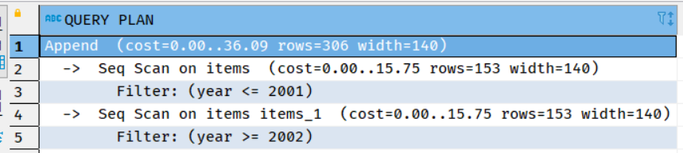
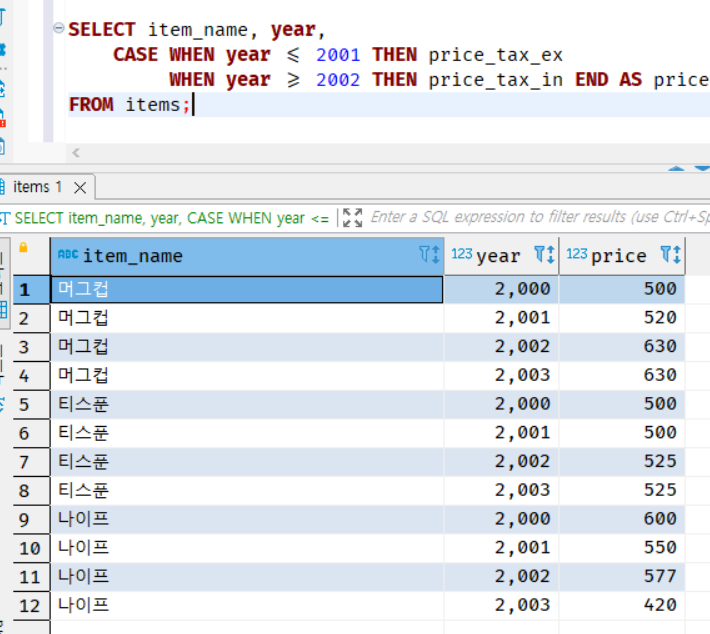
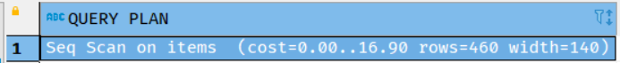

# chap 03 SQL의 조건 분기

<br>

* 2장에서 살펴 보았던 것처럼 SQL은 조건 분기를 할 때 CASE 식을 사용한다. 하지만 사실 CASE 식 이외에도
조건 분기에 사용할 수 있는 구문이 있다. 바로 집합 연산을 할 때 사용하는 UNION이다. 

* CASE 식은 절차형 프로그래밍 언어에서 사용하고 있는 IF-THEN-ELSE 구문 또는 SWITCH 구문의 기능을 SQL로 이식한 것으로도 
볼 수 있다. 하지만 이해하기 힘들다 보니, 처음 SQL을 배울 때 어렵게 느끼고 조금씩 멀어지는 경우가 많다. 
그에 따라 CASE 식이 아니라 UNION이 조건 분기를 할 때 더 많이 사용되기 시작했다. 

* 하지만 이는 SQL에 있어서 굉장히 좋지 않은 일이다. UNION은 조건 분기를 위해 만들어진 것이 아니다. 
따라서 조건 분기에 적합하지 않다. 

* 많은 사람들이 어떻게 작동할 지 쉽게 예측할 수 있다는 이유에서 UNION을 많이 사용하고 있는데, 이번 장에서는 
UNION을 조건 분기의 도구로 사용하지 않고, CASE 방식이라는 SQL의 원래 조건 분기 기능을 몸에 밸 수 있게 한다. 
그렇게 해야만 간결하고 성능적으로 뛰어난 SQL 구문을 만들 수 있다. 


## 8강 - UNION을 사용한 쓸데 없이 긴 표현

* UNION을 사용한 조건 분기는 SQL 초보자가 좋아하는 기술 중 하나이다. 일반적으로 이러한 조건 분기는, WHERE구만
조금씩 다른 여러 개의 SELECT 구문을 합쳐서, 복수의 조건에 일치하는 하나의 결과 집합을 얻고 싶을 때 사용한다. 

* 이러한 방법은 큰 문제를 작은 문제로 나눌 수 있다는 점에서 생각하기 쉽다는 장점이 있다. 
따라서 조건 분기와 관련된 문제를 접할 때 가장 처음 생각할 수 있는 기본적인 방법이다. 

* 하지만 이런 방법은 성능적인 측면에서 굉장히 큰 단점을 가지고 있다. 외부적으로는 하나의 SQL 구문을 실행하는 것처럼
보이지만, 내부적으로는 여러 개의 SELECT 구문을 실행하는 실행 계획으로 해석되기 때문이다. 따라서 테이블에 접근하는 회숫가 
많아져서 I/O 비용이 크게 늘어난다.

* 따라서 SQL에서 조건 분기를 할 때 UNION을 사용해도 좋을지 여부는 신중히 검토해야 한다. 아무 생각 없이 무조건 UNION을 
사용해서는 안 된다. 이번 8강에서는 UNION과 CASE를 사용한 조건 분기를 비교하면서, 어떤 경우에 어떤 것을 사용하는 것이 좋을지
알아보겠다.


### 1. UNION을 사용한 조건 분기와 관련된 간단한 예제

* 상품을 관리하는 테이블 Items가 있다. 이 테이블은 각각의 상품에 대해서 세금이 포함된 가격과 세금이 포함되지 않은 
가격을 모두 저장한다. 그런데 2002년부터 법이 개정되면서 세금이 포함된 가격을 표시하는 게 의무가 되었다. 따라서 2001년까지는
세금이 포함되지 않은 가격을, 2002년부터는 세금이 포함된 가격을 'price(가격)'필드로 표시하게 되었다.

코드 3-1 UNION을 사용한 조건 분기
```sql
select item_name, year, price_tax_ex as price
from items
where year <= 2001
union all 
select item_name, year, price_tax_in as price
from items 
where year >= 2002
```
* 조건이 배타적이므로 중복된 레코드가 발생하지 않는다. 쓸데없이 정렬 등의 처리를 하지 않아도 되므로 UNION ALL을 
사용했다. 하지만 포인트는 다른 곳에 있다. 

* 이 코드는 굉장히 큰 문제점을 안고 있다.

    1. 쓸데 없이 길다는 것. 거의 같은 두 개의 쿼리를 두 번이나 실행하고 있다. 이는 SQL을 쓸데없이 길고, 읽기 힘들게 만들 뿐이다.
    2. 성능

#### - UNION을 사용했을 때의 실행 계획 문제

* UNION을 사용한 쿼리의 성능 문제를 명확히 하기 위해 실행 계획을 살펴보겠다. 

그림 3-3 UNION을 사용한 경우의 실행 계획(PostgreSQL)


* UNION 쿼리는 Items 테이블에 2회 접근한다는 것을 알 수 있다. 그리고 그때마다 TABLE ACCESS FULL이 발생하므로, 읽어들이는 비용도 테이블의 크기에 따라 선형으로 증가하게 된다.
물론 데이터 캐시에 테이블의 데이터가 있으면 어느 정도 그런 증상이 완화되겠지만, 테이블의 크기가 커지면 캐시 히트율이 낮아지므로
그러한 것도 기대하기 힘들어진다. 

#### - 정확한 판단 없는 UNION 사용 회피

* 간단한게 레코드 집합을 합칠 수 있다는 점에서 UNION은 굉장히 편리한 도구이다. 따라서 UNION을 조건 분기를 위해 
사용하고 싶은 유혹에 사로잡히는 것도 무리는 아니다. 하지만 이는 굉장히 위험한 생각이다. 정확한 판단 없이 
SELECT 구문 전체를 여러 번 사용해서 코드를 길게 만드는 것은 쓸데없는 테이블 접근을 발생시키며 SQL의 성능을 나쁘게 만든다.
또한 물리 자원(저장소의 I/O 비용)도 쓸데없이 소비하게 된다.

### 2. WHERE 구에서 조건 분기를 하는 사람 사람은 초보자

* 시스템 개발의 세계에서는 앞선 사람들의 지혜와 노하우가 간단한 격언처럼 남아있다. 예를 들어서 "GOTO는 사용하지 않는 것이 좋다",
"데이터 구조가 코드를 결정하지만, 코드가 데이터 구조를 결정하지는 못한다", "버그가 아니라 원래 그렇게 만든 것이다"등처럼 말이다.

* SQL에도 이러한 격언들이 있다. 그중에서 "조건 분기를 WHERE구로 하는 사람들은 초보자다. 잘하는 살마은 SELECT 구만으로 조건 분기를 한다"
라는 말이 있다. 지금 살펴보고 있는 문제도 SELECT 구만으로 조건 분기를 하면 다음과 같이 최적화할 수 잇다. 

코드 3-2 SELECT 구문에서 CASE식을 사용한 조건 분기
```sql
SELECT item_name, year,
    CASE WHEN year <= 2001 THEN price_tax_ex
         WHEN year >= 2002 THEN price_tax_in END AS price
FROM items;
```



* 이 쿼리도 UNION을 사용한 쿼리와 같은 결과를 출력한다. 하지만 성능적으로 이번 쿼리가 훨씬 좋다.
  (테이블의 크기가 커질수록 더 명확하게 드러난다.)

### 3. SELECT 구를 사용한 조건 분기의 실행 계획

* CASE 식을 사용한 쿼리의 실행 계획은 다음과 같다. 

그림 3-5 CASE 식을 사용한 조건 분기(PostgreSQL)


* Item 테이블에 대한 접근이 1회로 줄어든 것을 확인할 수 있다. 이전의 UNION을 사용한 구문보다 성능이 2배 좋아졌다고 할 수 있다.
또한 구문 자체의 가독성도 굉장히 좋아졌다.

* 이처럼, SQL 구문이 성능이 좋은지 나쁜지는 반드시 실행 계획 레벨에서 판단해야 한다. 이유는 1장에서도 설명했던 것처럼, SQL구문에는
어떻게 데이터를 검색할지를 나타내는 접근 경로가 쓰여 있지 않기 때문이다. 이를 알려면 실행 계획을 보는 수밖에 없다.

* 사실 이는 좋은 것이 아니다. "사용자가 데이터에 접근 경로라는 물리 레벨의 문제를 의식하지 않도록 하고 싶다"라는 것이 RDB와 SQL이 가진 컨셉이기
때문이다. 하지만 이런 뜻을 이루기에는 현재의 RDB와 SQL(그리고 하드웨어)는 역부족이다. 따라서 은폐하고 있는 접근 경로를 엔지니어가 체크해줘야 한다.

* UNION과 CASE의 쿼리를 구문적인 관점에서 비교하면 재미난 것이 있다. UNION을 사용한 분기는 SELECT '구문'을 기본 단위로 분기하고 있다.
구문을 기본 단위로 사용하고 있다는 점에서, 아직 절차 지향형의 발상을 벗어나지 못한 방법이라고 말할 수 있다. 반면 CASE 식을 사용한 분기는 
문자 그대로 '식'을 바탕으로 하는 사고이다. 이렇게 '구문'에서 '식'으로 사고를 변경하는 것이 SQL을 마스터하는 열쇠 중 하나이다.

* 처음부터 그런 변경을 쉽게 실현하기는 힘들다. 요령을 하나 말하자면, 어떤 문제가 있을 때 스스로 "문제를 절차 지향적 언어로 해결한다면 어떤 IF 조건문을 사용해야 할까?"라고
사고할 때마다 "이것을 SQL의 CASE로는 어떻게 해결할 수 있지?"라는 것을 꾸준히 의식하는 것이다. 이것만으로 큰 도움이 될 것이다.

